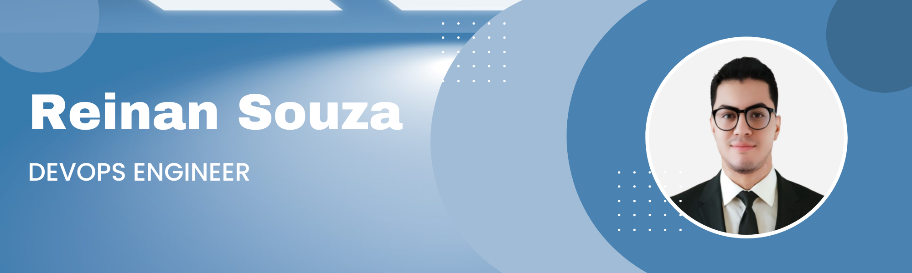

### Hi there, I'm Reinan Gabriel 

Sou um entusiasta da tecnologia apaixonado por aprender e explorar novas áreas. Veja algumas das minhas principais competências:

- Sou engenheiro de DevOps com conhecimentos sólidos em implantação e gerenciamento de infraestruturas Google Cloud.
- Possuo experiência em integrações de gateways e ferramentas, API, filas e gRPC.
- Tenho habilidade em CI/CD utilizando ferramentas como Github Action, Azure Devops, CircleCI e Gitlab.
- Tenho experiência em versionamento de código e utilização de ferramentas ágeis como Jira e Confluence.
- Tenho experiência em IaC (Infrastructure as Code) utilizando ferramentas como Terraform.

### Breve apresentação sobre min

Além de trabalhar em projetos profissionais, também gosto de contribuir para projetos Open Source e participar de eventos e comunidades de tecnologia. 
 

Sou um defensor do conhecimento compartilhado e adoro ajudar outras pessoas a crescer em suas carreiras.

### 📝 Latest blog posts

- [Limarka: como escrever um tcc em markdown](https://youtu.be/zuw0Fo1la2U)
- [React Tik Tok UI Clone - Demo](https://youtu.be/T0G-G76UNdw)
- [Godot websocket multiplayer - NodeJS](https://youtu.be/USYVrXiCgSI)
- [Demonstrando minha inteligência artificial](https://youtu.be/UoSQYAwSWT4)

### Experiência de trabalho

Na visão geral abaixo você encontrará minha experiência de trabalho mais recente:

**Software Engineer** \
[**MOVA**](https://mova.vc/) • Full-time \
Linguagens & Tecnologias: `Google Cloud`, `Kubernetes`, `CI/CD`, `Terraform`, `GoLang`, `Hyperf`,\
Tempo integral · 1 a 5 m
 

**Desenvolvedor PHP - Júnior** \
[**Marata**](https://marata.com.br/) • Full-time \
Linguagens & Tecnologias: `Laravel`, `Vue.js`, `MySQL`\
Tempo integral · 1 a 2 m
 

Por favor, encontre-me no [LinkedIn](https://www.linkedin.com/in/reinanhs/) para uma descrição mais detalhada da minha experiência de trabalho, educação e certificação.

### ⭐ Informações para contato

Se você deseja entrar em contato comigo, fique à vontade para me enviar uma mensagem através das minhas principais redes sociais listadas abaixo. Será um prazer trocar conhecimentos e discutir possíveis oportunidades de colaboração.

